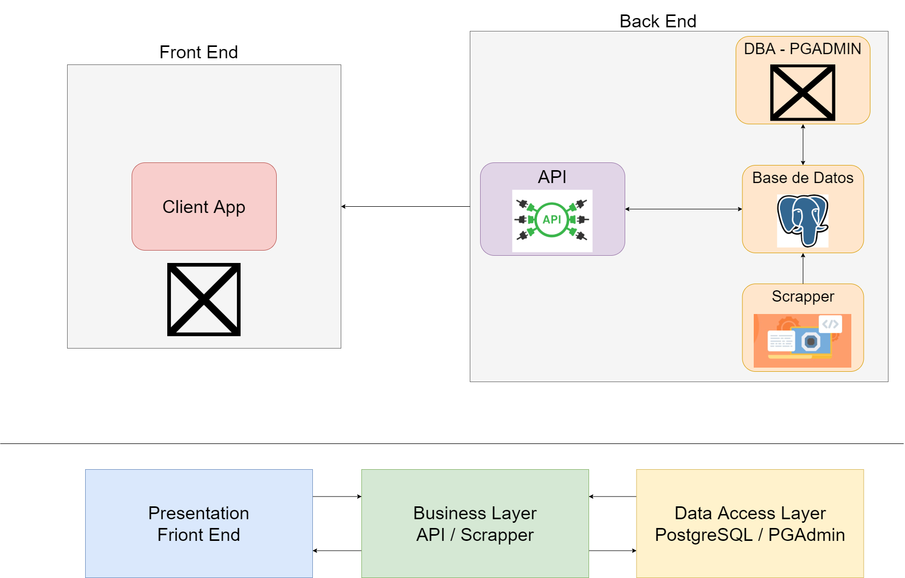
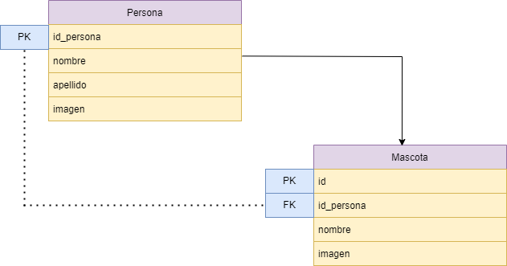

# Project_Layered_Architecture
**Proyecto final para la materia de arquitectura de software**

## Diagrama de Arquitectura

## Diagrama Base de Datos

## Pasos para la ejecucion del proyecto

1. Para correr el docker ingresar el comando "docker-compose up" en nuestro respositorio "Project_Layered_Architecture" de Github.

2. Una vez hecho lo anterior, detenerlo y correr cada contenedor en este orden.  
* Primero el contenedor "DB_A".
* Despues el contenedor "pgadmin4_B".
* Despues el contenedor "scraper_C".
* Despues el contenedor "api_D"
* Por ultimo el contenedor "project_layered_architecture_web_1"

**Todo esto es para poder correr la aplicacion sin problema alguno.**

## Link de video subido a Google Drive y a Youtube
[Link del Drive](https://drive.google.com/file/d/1MF7ki_LorPT64uMD7ldeNR5O8fyFV_bx/view?usp=sharing)

[Link Video Youtube](https://youtu.be/wHIUUU-3Ce4)